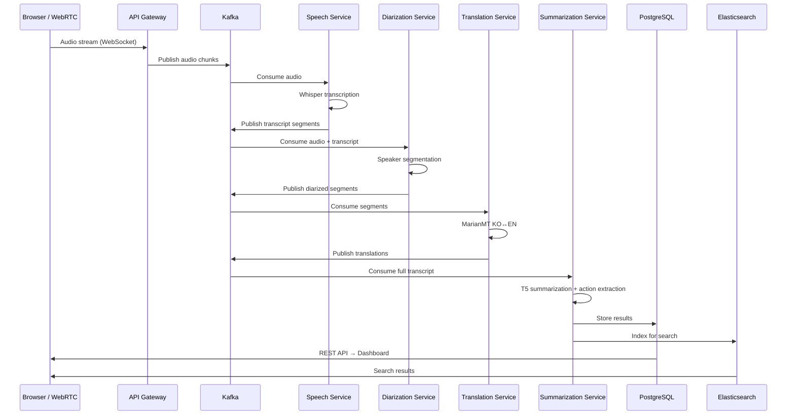
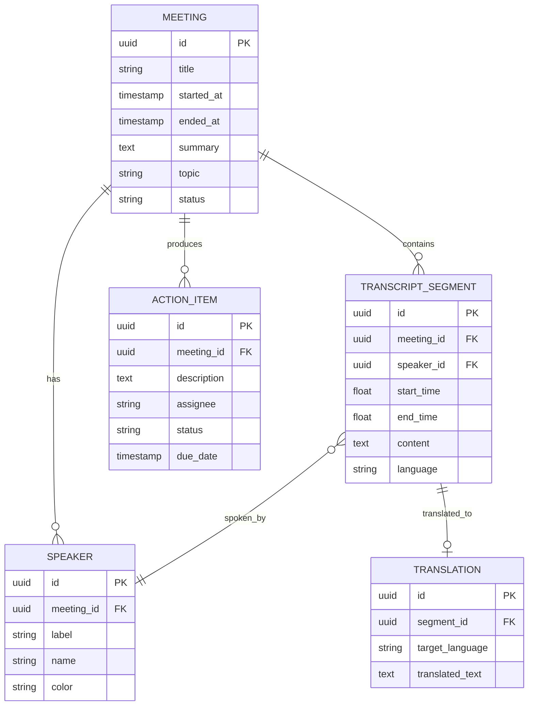

# System Design — Meeting Intelligence Platform

## Overview

The system is a **microservices architecture** with four AI-powered services connected via Kafka message queues. Data is persisted in PostgreSQL and indexed in Elasticsearch for semantic search.

## Data Flow

## Service Boundaries

| Service | Responsibility | Model | Port |
|---|---|---|---|
| Speech Service | Audio → text transcription | Whisper (base/small) | 8001 |
| Diarization Service | Speaker identification & segmentation | pyannote.audio | 8002 |
| Translation Service | Bidirectional KO ↔ EN | MarianMT | 8003 |
| Summarization Service | Summary, action items, topics | T5 + BERTopic | 8004 |

## Data Models

## Scalability Considerations

- **Kafka partitioning**: Scale consumers horizontally per service
- **Model serving**: GPU-backed pods with autoscaling
- **Elasticsearch**: Sharded index for high-volume search
- **WebSocket fan-out**: Redis Pub/Sub for multi-client broadcast
